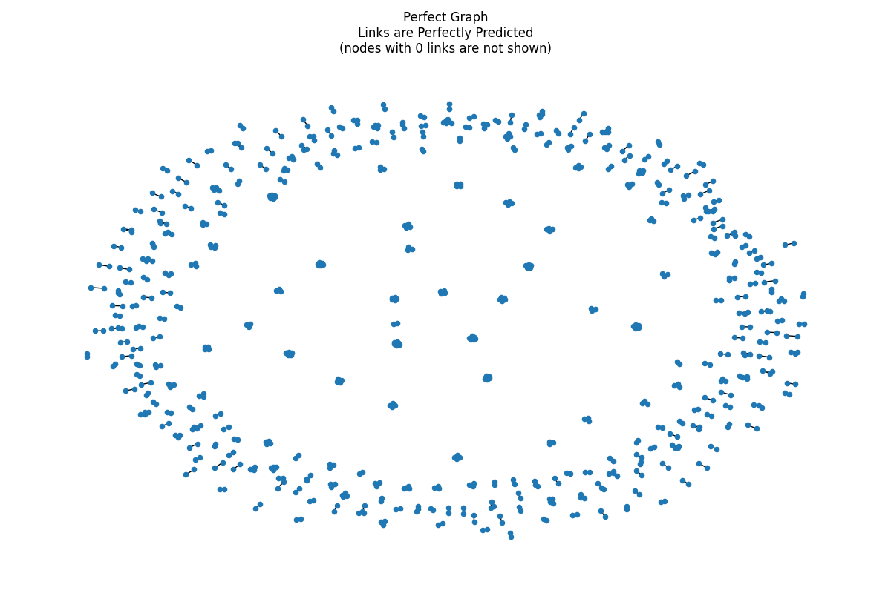

# entity-linking-eval-framework
A framework for testing and evaluating entity linking models.


This framework assumes the data is tabular, consisting of entity features like name, address, DoB, etc.  The models 
to be evaluated are essentially performing link prediction.  Therefore, the framework generates links by corrupting 
and mixing entity attributes.  For example, "John Doe" might become "John Dooe" and the model would need to learn that 
the misspelling of the last name actually refers to the same entity, so those two records should be linked.  

The framework consists of 3 parts:
1. Dagster orchestrated evaluation pipeline
2. MLFlow experiment tracking
3. Dash app for model diagnostics

To use the framework, one would run the Dagster job for evaluation.  This would generate a dataset, split it into 
train and test sets, create features, fit a model to the training set, get model predictions for the test set, and 
score the results on the test set.  Dagster handles logging to MLFLow automatically.  After running the pipeline, 
it is possible to view the experiment results in MLFlow's UI, or the model diagnostics Dash app.

### Feature Engineering and Model

Out of the box, only a handful of features are created, and basic scikit-learn classifiers are available.  These are 
meant to be replaced by external processes, such as a model API.

### Why Dagster?

A Dagster sensor can be configured to do an evaluation run any time a change is detected in the feature engineering or 
modeling steps.  Dagster and MLFlow can promote a challenger model to the new champion to automate model updates. 

## How to Run

First time setup for local runs should install requirements.  Either use a virtual environment or Docker.

The evaluation pipeline can be run from the command line or from the Dagster webserver UI.  To run from the command 
line:
```commandline
python evaluation_pipeline.py --run_type single
```

The run_type parameter can be single or multi.  Multi runs are useful for testing different parameters for the data 
generator.  

To run from the Dagster webserver UI, first start it up:
```commandline
dagster dev
```

Go to the URL and execute the `evaluate` job with the configuration that you want.  An example configuration is shown 
below.  Configuration requirements are defined by pydantic models for each op and asset.

```commandline
ops:
    generate_data:
        config:
            dataset_size: 1000
            perc_exact_match: 0.1
            perc_non_match: 0.5
            fuzzy_match_corruption_perc: 0.5
            fuzzy_match_mingle_perc: 0.25
            use_pareto_dist_for_degrees: True
            raw_file_path: "eval_data/raw-1000.parquet"
    engineer_features:
        config:
                raw_file_path: "eval_data/raw-1000.parquet"
                train_test_ratio: 0.7
    train_model:
        config:
            model_name: "lr"
    log_mlflow_metrics:
        config:
            track_mlflow_experiment: True
    save_data_for_dashboard:
        config:
            dashboard_data_path: "dashboard/data/"
```

To start the MLFlow server and view experiment results:
```commandline
mlflow server
```

To start the Dash app for model diagnostics:
```commandline
cd dashboard
python app.py
```

The Dash app shows the results for the most recent run only.  It will not have results for all past experiments like 
MLFlow does.

## How the Data Generator Works

The data generator is the most important part of this framework.  It generates synthetic data to precise specifications 
to enable models to be tested under a variety of conditions.

The data generator should be adapted to match the real data that would be expected.  For example, if the real dataset 
to be modeled has misspellings in 10% of the data, then the corruption percentage of the data generator should be set 
to 10%.  

The generator assumes a power law distribution of degrees.  This is a reasonable assumption, as most networks follow 
a power law distribution of degrees.  Depending on how the generator is configured, 0 links or 1 link can be set as the 
base of this distribution.  Setting to 1 would mean that most entities would have only 1 link, fewer entities would 
have 2 links, even fewer would have 3 links, and so on, up to the maximum number of degrees that is specified.  The 
shape of the distribution is controlled by a parameter called alpha, which can produce highly unequal distributions, or 
highly equal distributions.  For example, a large alpha will skew the degree distribution so that only a small number 
of entities have most of the links (this would mean that all corruptions of the data stemmed from only a small subset 
of entities).  Conversely, a small alpha will flatten the degree distribution so that entities have more similar 
numbers of links (this would mean that all corruptions of the data come more evenly from the samples).  Alpha should 
be set to a value that resembles what is seen in the real data.


The generator builds 2 graphs.  
1. The first is a random graph - a graph with the specified degree distribution where 
links are predicted randomly.  This graph serves as a baseline for entity linking, as it results in a graph with a few 
very large connected components.  Due to the transitive property, these entities are all linked, incorrectly.  The Gini 
coefficient measures the inequality of the distribution of connected component sizes, and it is larger for randomly 
generated graphs like this, where the graph is generated without taking transitive linking into consideration.  

2. The second is a perfect graph - a graph with the specified degree distribution where 
links are predicted perfectly.  This is the target that a model should aim for.  It is a graph with smaller, well 
defined connected components.  The Gini coefficient is much smaller to reflect a more even distribution of connected 
components. 


These 2 graphs' Gini coefficients for the connected components can serve as benchmarks for the model.  A good model 
should have a small coefficient, similar to the perfect graph.  It is a handy way to evaluate the model, even without 
having labeled data.

One model can perform very differently for differently generated data, which is why this generator is so important.  
Model selection should begin with tuning this synthetic data generator to generate data that most closely resembles the 
real data to be modeled.  
